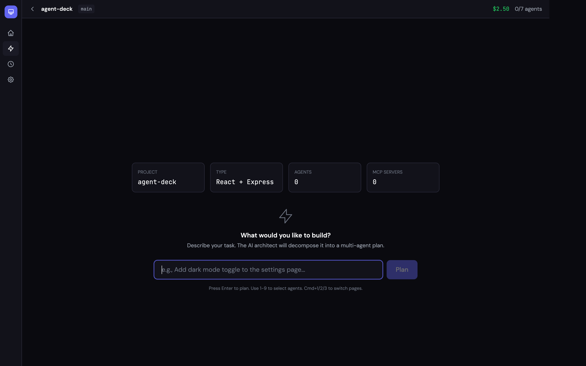

# Agent Deck

Web-based command center for orchestrating multiple AI coding agents.

Describe a task in plain English. The AI architect decomposes it into a multi-agent execution plan (DAG). Agents run in parallel where dependencies allow, with real-time streaming, cost tracking, and git finalize — all in your browser.



## Features

- **AI Task Decomposition** — Describe what you want; the architect plans a multi-agent DAG automatically
- **DAG Execution Engine** — Kahn's algorithm with parallel scheduling, dependency resolution, and configurable failure strategies
- **Multi-Project Workspaces** — Manage multiple projects from a single dashboard; auto-detects framework, language, and git branch
- **Real-Time Streaming** — Watch agent output as it happens (text, thinking, tool calls) via WebSocket
- **Finalize System** — Review changed files, AI-generated commit message, one-click git commit + push
- **Cost Tracking** — Per-agent and total cost with real-time estimates
- **History** — Browse past missions by project, expand agent breakdowns, view commit info
- **Team Configs** — Pre-define agent teams in YAML and launch with one click
- **Multi-Runtime** — Claude Code, Codex, Gemini CLI, or any model via LiteLLM proxy
- **Session Recovery** — SQLite-backed persistence with crash recovery

## Quick Start

```bash
npx agent-deck
```

Open **http://localhost:3002** — add your project, describe a task, and launch.

### Requirements

- Node.js 18+
- [Claude Code CLI](https://docs.anthropic.com/en/docs/claude-code) installed (`claude` in PATH)

### From source

```bash
git clone https://github.com/anthropics/agent-deck.git
cd agent-deck
npm install
npm run dev        # Dev mode with hot reload (localhost:5200)
```

## How It Works

```
┌─ Home ────────────────────────────────────────────────┐
│  Select a project  →  Command Center  →  Finalize     │
│                                                       │
│  1. Describe task     "Add auth middleware"            │
│  2. AI plans DAG      [researcher] → [implementer]    │
│                       [implementer] → [tester]        │
│  3. Review & launch   Agents run in parallel          │
│  4. Monitor           Real-time streaming + cost      │
│  5. Finalize          Review diff → commit → push     │
│  6. History           Browse by project + date        │
└───────────────────────────────────────────────────────┘
```

### Architecture

```
Browser (:5200)               Server (:3002)
┌────────────────┐            ┌──────────────────────────┐
│  React +       │◄──WS/REST──│  Express + WebSocket      │
│  Tailwind +    │            │                          │
│  React Flow    │            │  WorkspaceManager         │
│                │            │  Architect (Claude CLI)   │
│  Home          │            │  WorkflowExecutor (DAG)   │
│  CommandCenter │            │  DeckManager              │
│  History       │            │  ├─ ClaudeAdapter         │
│  Settings      │            │  ├─ LiteLLMAdapter        │
│                │            │  └─ CodexAdapter          │
│  FinalizePanel │            │  FinalizeModule (git ops) │
│  DiffViewer    │            │                          │
└────────────────┘            │  SQLite (better-sqlite3)  │
                              └──────────────────────────┘
```

## Usage

### Workflow

1. **Home** — Add project directories. Each card shows framework, language, git branch, and mission stats.
2. **Command Center** — Enter a task description. The AI architect decomposes it into 2-6 specialized agents.
3. **Planning Canvas** — Review the DAG. Adjust if needed. Click **Launch**.
4. **Running Canvas** — Watch agents execute in real-time. React Flow DAG shows live status per node.
5. **Finalize** — After all agents complete, review changed files, edit the AI-generated commit message, then Commit or Commit & Push.
6. **History** — Browse past missions filtered by project. Expand to see agent breakdown and commit info.

### Team Configs

Pre-define agent teams and launch them with one click.

Drop YAML files in `team-configs/`:

```yaml
# team-configs/fullstack-squad.yaml
name: "Squad: Plan + Build + Test"
description: Full development squad
settings:
  max_budget_usd: 5.0
agents:
  - name: planner
    model: sonnet
    prompt: Create a detailed implementation plan.
  - name: implementer
    model: sonnet
    prompt: Implement the feature according to the plan.
  - name: tester
    model: haiku
    prompt: Write comprehensive tests for the implementation.
```

### LiteLLM Proxy

Run any model supported by [LiteLLM](https://github.com/BerriAI/litellm):

```bash
litellm --model gpt-4o                                    # Start proxy
LITELLM_PROXY_URL=http://localhost:4000 npx agent-deck     # Connect
```

### Keyboard Shortcuts

| Key | Action |
|-----|--------|
| `Cmd/Ctrl + 1` | Command Center |
| `Cmd/Ctrl + 2` | History |
| `Cmd/Ctrl + 3` | Settings |
| `1-9` | Select agent by index |
| `Escape` | Deselect / close panel |

## Configuration

| Variable | Default | Description |
|----------|---------|-------------|
| `PORT` | `3002` | Server port |
| `DECK_MAX_AGENTS` | `10` | Max concurrent agents |
| `DECK_IDLE_THRESHOLD_SECONDS` | `300` | Idle detection threshold |
| `LITELLM_PROXY_URL` | — | LiteLLM proxy URL |
| `AGENT_STATE_DB` | `~/.claude/agent-state.db` | Agent-state bridge (read-only) |

## API

### REST — `http://localhost:3002/api/deck`

| Method | Path | Description |
|--------|------|-------------|
| `GET` | `/workspaces` | List workspaces |
| `POST` | `/workspaces` | Add workspace `{path, name?}` |
| `PATCH` | `/workspaces/:id` | Rename workspace |
| `DELETE` | `/workspaces/:id` | Remove workspace |
| `POST` | `/mission/plan` | AI task decomposition `{task, workspaceId?}` |
| `POST` | `/workflow/launch` | Launch DAG workflow `{plan, name, workspaceId?}` |
| `GET` | `/history` | List workflows `?workspaceId=` |
| `GET` | `/history/:id` | Workflow detail with nodes |
| `DELETE` | `/history/:id` | Delete workflow |
| `GET` | `/finalize/changes` | Changed files `?workspaceId=` |
| `POST` | `/finalize/message` | AI commit message `{workspaceId?, task?}` |
| `POST` | `/finalize/execute` | Git commit+push `{selectedFiles, commitMessage, push?}` |
| `GET` | `/agents` | List all agents |
| `POST` | `/agents` | Spawn agent |
| `DELETE` | `/agents/:id` | Kill agent |
| `GET` | `/cost` | Cost summary + estimates |
| `GET` | `/teams` | List team configs |
| `POST` | `/teams/:id/launch` | Launch team |

### WebSocket — `ws://localhost:3002/ws`

Subscribe with `{"type": "deck:subscribe"}`. Receives:

- `deck:agent:status` — Agent status changes
- `deck:agent:output` — Streaming output (text, tool calls, thinking)
- `deck:agent:cost` — Cost estimate updates
- `deck:agent:context` — Context window usage
- `deck:workflow:status` — Workflow status (running/finalizing/completed/failed)
- `deck:workflow:node` — Individual node status updates

## Development

```bash
npm run dev           # Server (:3002) + Client (:5200) with hot reload
npm run dev:server    # Server only (tsx watch)
npm run dev:client    # Client only (Vite)
npm run build         # Production build
npm run typecheck     # TypeScript check
npm start             # Production server
```

### Project Structure

```
agent-deck/
├── client/                    # React frontend
│   ├── pages/                 # Home, CommandCenter, History, Settings
│   ├── components/
│   │   ├── command-center/    # PlanningCanvas, RunningCanvas, FinalizePanel, DiffViewer
│   │   ├── home/              # ProjectCard, AddProjectModal
│   │   ├── layout/            # Shell, Sidebar, TopBar
│   │   └── shared/            # StatusDot, CostBadge, Toast
│   ├── hooks/                 # useWorkspaces, useProject, useWebSocket, useKeyboard
│   └── stores/                # Zustand store (deck-store.ts)
├── server/
│   ├── core/                  # types, db, architect, finalize, workspace-manager
│   ├── deck/                  # DeckManager, WorkflowExecutor, adapters, cost/context estimators
│   └── routes/                # REST API (workspaces, mission, history, finalize, agents, settings)
├── team-configs/              # YAML team definitions
├── data/                      # SQLite database (auto-created)
└── dist/                      # Built frontend (auto-generated)
```

## Tech Stack

- **Server**: Express + WebSocket (`ws`) + better-sqlite3 + tsx
- **Client**: React 18 + Tailwind CSS + Vite + Zustand + React Flow
- **DAG Engine**: Kahn's topological sort with parallel scheduling
- **Adapters**: Claude Code CLI, LiteLLM HTTP/SSE, Codex CLI
- **Zero external AI SDK dependencies** — talks directly to CLIs and HTTP APIs

## License

MIT
